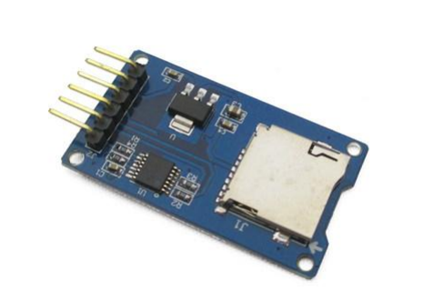

 # Practica 6: Buses de comunicación II (SPI)
## **Introducción**
El objetivo de la practica es comprender el funcionamiento del bus spi.
## **Información teórica**
El bus SPI tiene una arquitectura de tipo maestro-esclavo. El dispositivo maestro (master) puede iniciar la comunicación con uno o varios dispositivos esclavos (slave), y enviar o recibir
datos de ellos. Los dispositivos esclavos no pueden iniciar la comunicación, ni intercambiar datos entre ellos directamente.
En el bus SPI la comunicación de datos entre maestros y esclavo se realiza en dos líneas independientes, una del maestro a los esclavos, y otra de los esclavos al maestro. Por tanto
la comunicación es Full Duplex, es decir, el maestro puede enviar y recibir datos simultáneamente.
Otra característica de SPI es que es bus síncrono. El dispositivo maestro proporciona una señal de reloj, que mantiene a todos los dispositivos sincronizados. Esto reduce la complejidad del sistema frente a los sistemas asíncronos.
Por tanto, el bus SPI requiere un mínimo de 3 líneas.


## **Hardware**

* ESP32-Wroom-32.
* El DAC MAX98357 (I2S).
* Tarjeta MICRO SD
* Lector SD


  
  ##### **Tabla de conexión**
  
| SPI | MOSI  | MISO | CLK | CS |
|----------|----------|-------|-------|---------|
| VSPI      |  GPIO 21| GPIO 19   |GPIO 18| GPIO 5|
| HSPI       |GPIO 13|   GIPIO 12  |GPIO 14| GPIO 15|

## **Software y su funcionamiento**
### **Cabecera del código**
Como en la práctica anterior, añadimos la librería correspondiente para hacer uso de la Tarjeta SD "SD.h" y la librería "SPI.h", que contiene las funciones necesarias para controlar el hadware integrado del SPI.


```cpp
#include <Arduino.h>
#include <SPI.h>
#include <SD.h>
```
### **Estructura del Setup**
En la estructura del Setup, iniciamos la velocidad de comunicación en 115200 ms, originalmente el cs estaba programado con el begin(4), pero como nuestra ESP32 estaba conectada al gpio 5, no la detectaba, este error se soluciona escribiendo begin(5). Una vez inicialicemos correctamente, con la sentencia "myFile = SD.open("archivo.txt");" abriremos el archivo, y se leerá. Una vez se haya leído, se cerrará el archivo: "myFile.close();" y finaliza el setup.

```cpp
void setup()
{
  Serial.begin(115200);
  Serial.print("Iniciando SD ...");
  if (!SD.begin(5)) {
    Serial.println("No se pudo inicializar");
    return;
  }
  Serial.println("inicializacion exitosa");
 
  myFile = SD.open("archivo.txt");
  if (myFile) {
    Serial.println("archivo.txt:");
    while (myFile.available()) {
      Serial.write(myFile.read());
    }
    myFile.close(); //cerramos el archivo
  } else {
    Serial.println("Error al abrir el archivo");
  }
}

```
## **Código completo**
```cpp
#include <Arduino.h>

#include <SPI.h>
#include <SD.h>

File myFile;

void setup()
{
  Serial.begin(115200);
  Serial.print("Iniciando SD ...");
  if (!SD.begin(5)) {
    Serial.println("No se pudo inicializar");
    return;
  }
  Serial.println("inicializacion exitosa");
 
  myFile = SD.open("archivo.txt");//abrimos  el archivo 
  if (myFile) {
    Serial.println("archivo.txt:");
    while (myFile.available()) {
      Serial.write(myFile.read());
    }
    myFile.close(); //cerramos el archivo
  } else {
    Serial.println("Error al abrir el archivo");
  }
}

void loop()
{
  
}
```
