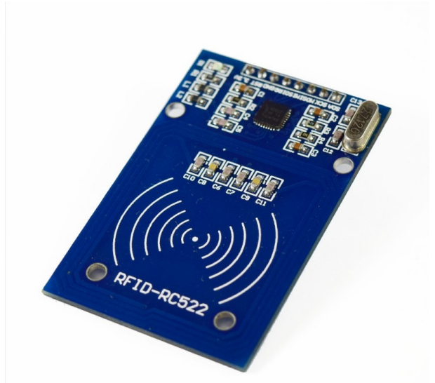

# Practica 6: Buses de comunicación II (SPI)
## **Introducción**
El objetivo de la practica es comprender el funcionamiento del bus spi.

## **Infromación teórica**
Los lectores RFID(Radio Frequency IDentification) en la actualidad están teniendo bastante acogida en los sistemas de identificación, su uso abarca desde sistemas de seguridad, acceso de personal, identificación y logística de productos, como llaves de puertas eléctricas, entre otras aplicaciones.

Su principio de funcionamiento consiste en pasar un TAG, cerca de un lector RFID, el TAG tiene la capacidad de enviar información al lector. Dicha información puede ser desde un simple código o todo un paquete  de información guardo en la memoria del Tag.

Los TAGs viene en diferentes modelos, los más comunes son en tarjetas y en llaveros, pero también vienen como etiquetas adhesivas e incluso ya viene incrustados en algunos productos. Los Tags tienen internamente una antena y un microchip, encargado de realizar todo el proceso de comunicación, la energía lo obtiene de la señal de radiofrecuencia, que si bien la energía en la señal es pequeña, es suficiente para hacer trabajar el microchip, esto es la razón por la que es necesario acercarlos a una pequeña distancia generalmente menor a 10 cm. Pero existen Tags activos, que incorporan baterías, estos tiene alcance de varios metros de distancia.

## **Hardware**

* ESP32-Wroom-32.
* El DAC MAX98357 (I2S).
* Tarjeta MICRO SD
* Lector RFID


  
  ##### **Tabla de conexión**
  
| SPI | MOSI  | MISO | CLK | CS |
|----------|----------|-------|-------|---------|
| VSPI      |  GPIO 21| GPIO 19   |GPIO 18| GPIO 5|
| HSPI       |GPIO 13|   GIPIO 12  |GPIO 14| GPIO 15|

## **Software y su funcionamiento**
### **Cabecera del código**
Es necesario utilizar la librería MFRC522.h, solamente se especifica los pines Reset y SDA(SS) del módulo, los demás pines trabajan con los pines SPI del Arduino. En nuestro caso el Pin Reset es el 27 y el SS es el 5, seguidamente creamos un objeto para el RC522 con la sentencia "MFRC522 mfrc522(SS_PIN, RST_PIN);".

```cpp
#include <Arduino.h>
#include <SPI.h>
#include <MFRC522.h>

#define RST_PIN 27    //Pin 27 para el reset del RC522
#define SS_PIN  5   //Pin 5 para el SS (SDA) del RC522
MFRC522 mfrc522(SS_PIN, RST_PIN); //Creamos el objeto para el RC522
```
### **Estructura del Setup**
En la estructura del Setup, iniciamos la velocidad de comunicación en 115200 ms.
```cpp
SPI.begin();        //Iniciamos el Bus SPI
  mfrc522.PCD_Init();
  ```
Con estas dos funciones iniciamos y configuramos al RC522 para su posterior lectura, solo es necesario llamarlo una vez en el set up.
```cpp
void setup() {
  Serial.begin(115200); //Iniciamos la comunicación  serial
  SPI.begin();        //Iniciamos el Bus SPI
  mfrc522.PCD_Init(); // Iniciamos  el MFRC522
  Serial.println("Lectura del UID");
}
```

### **Estructura del Loop**
 La estructura del Loop empieza con la siguiente sentencia "mfrc522.PICC_IsNewCardPresent()", que nos devuelve verdadero o falso dependiendo si hay una tarjeta presente cerca del módulo RC522.
 Posterioirmente seleciona una tarjeta para la lectura con "mfrc522.PICC_ReadCardSerial()".
 obtenemos el tamaño del código de identificación (mfrc522.uid.size)  y lo lee (mfrc522.uid.uidByte).
 Finalmente finaliza la lectura y acaba el loop con "mfrc522.PICC_HaltA".
```cpp
void loop() {
  // Revisamos si hay nuevas tarjetas  presentes
  if ( mfrc522.PICC_IsNewCardPresent()) 
        {  
      //Seleccionamos una tarjeta
            if ( mfrc522.PICC_ReadCardSerial()) 
            {
                  // Enviamos serialemente su UID
                  Serial.print("Card UID:");
                  for (byte i = 0; i < mfrc522.uid.size; i++) {
                          Serial.print(mfrc522.uid.uidByte[i] < 0x10 ? " 0" : " ");
                          Serial.print(mfrc522.uid.uidByte[i], HEX);   
                  } 
                  Serial.println();
                  // Terminamos la lectura de la tarjeta  actual
                  mfrc522.PICC_HaltA();         
            }      
  } 
}
```
## **Código completo**
```cpp
#include <Arduino.h>
#include <SPI.h>
#include <MFRC522.h>

#define RST_PIN 27    //Pin 27 para el reset del RC522
#define SS_PIN  5   //Pin 5 para el SS (SDA) del RC522
MFRC522 mfrc522(SS_PIN, RST_PIN); //Creamos el objeto para el RC522

void setup() {
  Serial.begin(115200); //Iniciamos la comunicación  serial
  SPI.begin();        //Iniciamos el Bus SPI
  mfrc522.PCD_Init(); // Iniciamos  el MFRC522
  Serial.println("Lectura del UID");
}

void loop() {
  // Revisamos si hay nuevas tarjetas  presentes
  if ( mfrc522.PICC_IsNewCardPresent()) 
        {  
      //Seleccionamos una tarjeta
            if ( mfrc522.PICC_ReadCardSerial()) 
            {
                  // Enviamos serialemente su UID
                  Serial.print("Card UID:");
                  for (byte i = 0; i < mfrc522.uid.size; i++) {
                          Serial.print(mfrc522.uid.uidByte[i] < 0x10 ? " 0" : " ");
                          Serial.print(mfrc522.uid.uidByte[i], HEX);   
                  } 
                  Serial.println();
                  // Terminamos la lectura de la tarjeta  actual
                  mfrc522.PICC_HaltA();         
            }      
  } 
}
```
